```python
# ============================================================
# POST LAB TASK
# Exploratory Data Analysis (EDA) on Titanic Dataset
# ============================================================

# Step 1: Import Required Libraries
import numpy as np
import pandas as pd
import matplotlib.pyplot as plt
import seaborn as sns

%matplotlib inline

import warnings
warnings.filterwarnings("ignore")

# ------------------------------------------------------------
# Step 2: Load Titanic Dataset
# ------------------------------------------------------------
df = sns.load_dataset('titanic')

# Display first five rows
print("First Five Rows:")
display(df.head())

# ------------------------------------------------------------
# Step 3: Dataset Information
# ------------------------------------------------------------
print("\nDataset Information:")
df.info()

# ------------------------------------------------------------
# Step 4: Dataset Shape
# ------------------------------------------------------------
print("\nShape of Dataset:")
print(df.shape)

# ------------------------------------------------------------
# Step 5: Column Names
# ------------------------------------------------------------
print("\nColumn Names:")
print(df.columns)

# ------------------------------------------------------------
# Step 6: Statistical Summary
# ------------------------------------------------------------
print("\nStatistical Summary:")
display(df.describe())

# ------------------------------------------------------------
# Step 7: Check Missing Values
# ------------------------------------------------------------
print("\nMissing Values:")
print(df.isnull().sum())

# ------------------------------------------------------------
# Step 8: Missing Value Percentage
# ------------------------------------------------------------
print("\nPercentage of Missing Values:")
print((df.isnull().sum()/len(df))*100)

# ------------------------------------------------------------
# Step 9: Check Duplicate Rows
# ------------------------------------------------------------
print("\nDuplicate Rows:")
print(df.duplicated().sum())

# ------------------------------------------------------------
# Step 10: Data Types
# ------------------------------------------------------------
print("\nData Types:")
print(df.dtypes)

# ============================================================
# Univariate Analysis
# ============================================================

# Survival Count
plt.figure(figsize=(6,4))
sns.countplot(x='survived', data=df)
plt.title("Survival Count")
plt.show()

# Passenger Class Distribution
plt.figure(figsize=(6,4))
sns.countplot(x='pclass', data=df)
plt.title("Passenger Class Distribution")
plt.show()

# Gender Distribution
plt.figure(figsize=(6,4))
sns.countplot(x='sex', data=df)
plt.title("Gender Distribution")
plt.show()

# Age Distribution
plt.figure(figsize=(8,5))
sns.histplot(df['age'], bins=30, kde=True)
plt.title("Age Distribution")
plt.show()

# Fare Distribution
plt.figure(figsize=(8,5))
sns.histplot(df['fare'], bins=40, kde=True)
plt.title("Fare Distribution")
plt.show()

# Age Boxplot
plt.figure(figsize=(6,5))
sns.boxplot(y=df['age'])
plt.title("Age Boxplot")
plt.show()

# Fare Boxplot
plt.figure(figsize=(6,5))
sns.boxplot(y=df['fare'])
plt.title("Fare Boxplot")
plt.show()

# ============================================================
# Bivariate Analysis
# ============================================================

# Survival by Gender
plt.figure(figsize=(6,4))
sns.countplot(x='sex', hue='survived', data=df)
plt.title("Survival by Gender")
plt.show()

# Survival by Passenger Class
plt.figure(figsize=(6,4))
sns.countplot(x='pclass', hue='survived', data=df)
plt.title("Survival by Passenger Class")
plt.show()

# Age vs Fare
plt.figure(figsize=(8,5))
sns.scatterplot(x='age', y='fare', hue='survived', data=df)
plt.title("Age vs Fare")
plt.show()

# ============================================================
# Correlation Analysis
# ============================================================

numeric_df = df.select_dtypes(include=['number'])

print("\nCorrelation Matrix:")
display(numeric_df.corr())

plt.figure(figsize=(10,8))
sns.heatmap(numeric_df.corr(), annot=True, cmap='coolwarm', linewidths=0.5)
plt.title("Correlation Heatmap")
plt.show()

# Pairplot
sns.pairplot(df[['survived','age','fare','pclass']])
plt.show()

# ============================================================
# Value Counts
# ============================================================

print("\nGender Count:")
print(df['sex'].value_counts())

print("\nPassenger Class Count:")
print(df['pclass'].value_counts())

print("\nSurvival Count:")
print(df['survived'].value_counts())

# ============================================================
# Handling Missing Values
# ============================================================

df['age'].fillna(df['age'].median(), inplace=True)
df['embarked'].fillna(df['embarked'].mode()[0], inplace=True)
df['embark_town'].fillna(df['embark_town'].mode()[0], inplace=True)

# Drop Deck column because it has many missing values
df.drop(columns=['deck'], inplace=True)

# ------------------------------------------------------------
# Verify Missing Values
# ------------------------------------------------------------
print("\nMissing Values After Cleaning:")
print(df.isnull().sum())

# ------------------------------------------------------------
# Final Dataset
# ------------------------------------------------------------
print("\nFirst Five Rows After Cleaning:")
display(df.head())

# ------------------------------------------------------------
# Final Shape
# ------------------------------------------------------------
print("\nFinal Shape:")
print(df.shape)

# ============================================================
# Conclusion
# ============================================================

print("\n========== EDA SUMMARY ==========")
print("1. Dataset contains 891 rows and 15 columns.")
print("2. Missing values were found in Age, Embarked, Embark Town, and Deck.")
print("3. Missing values were handled using median and mode.")
print("4. Deck column was removed because it contained too many missing values.")
print("5. Most passengers belonged to Third Class.")
print("6. Male passengers were more than female passengers.")
print("7. Female passengers had a higher survival rate.")
print("8. First Class passengers had better survival chances.")
print("9. Fare contains several outliers.")
print("10. Most passengers were between 20 and 40 years old.")
print("11. Correlation analysis shows Fare is positively related to survival, while Passenger Class is negatively related to survival.")

print("\nEDA Completed Successfully.")
```

    First Five Rows:
    


<div>
<style scoped>
    .dataframe tbody tr th:only-of-type {
        vertical-align: middle;
    }

    .dataframe tbody tr th {
        vertical-align: top;
    }

    .dataframe thead th {
        text-align: right;
    }
</style>
<table border="1" class="dataframe">
  <thead>
    <tr style="text-align: right;">
      <th></th>
      <th>survived</th>
      <th>pclass</th>
      <th>sex</th>
      <th>age</th>
      <th>sibsp</th>
      <th>parch</th>
      <th>fare</th>
      <th>embarked</th>
      <th>class</th>
      <th>who</th>
      <th>adult_male</th>
      <th>deck</th>
      <th>embark_town</th>
      <th>alive</th>
      <th>alone</th>
    </tr>
  </thead>
  <tbody>
    <tr>
      <th>0</th>
      <td>0</td>
      <td>3</td>
      <td>male</td>
      <td>22.0</td>
      <td>1</td>
      <td>0</td>
      <td>7.2500</td>
      <td>S</td>
      <td>Third</td>
      <td>man</td>
      <td>True</td>
      <td>NaN</td>
      <td>Southampton</td>
      <td>no</td>
      <td>False</td>
    </tr>
    <tr>
      <th>1</th>
      <td>1</td>
      <td>1</td>
      <td>female</td>
      <td>38.0</td>
      <td>1</td>
      <td>0</td>
      <td>71.2833</td>
      <td>C</td>
      <td>First</td>
      <td>woman</td>
      <td>False</td>
      <td>C</td>
      <td>Cherbourg</td>
      <td>yes</td>
      <td>False</td>
    </tr>
    <tr>
      <th>2</th>
      <td>1</td>
      <td>3</td>
      <td>female</td>
      <td>26.0</td>
      <td>0</td>
      <td>0</td>
      <td>7.9250</td>
      <td>S</td>
      <td>Third</td>
      <td>woman</td>
      <td>False</td>
      <td>NaN</td>
      <td>Southampton</td>
      <td>yes</td>
      <td>True</td>
    </tr>
    <tr>
      <th>3</th>
      <td>1</td>
      <td>1</td>
      <td>female</td>
      <td>35.0</td>
      <td>1</td>
      <td>0</td>
      <td>53.1000</td>
      <td>S</td>
      <td>First</td>
      <td>woman</td>
      <td>False</td>
      <td>C</td>
      <td>Southampton</td>
      <td>yes</td>
      <td>False</td>
    </tr>
    <tr>
      <th>4</th>
      <td>0</td>
      <td>3</td>
      <td>male</td>
      <td>35.0</td>
      <td>0</td>
      <td>0</td>
      <td>8.0500</td>
      <td>S</td>
      <td>Third</td>
      <td>man</td>
      <td>True</td>
      <td>NaN</td>
      <td>Southampton</td>
      <td>no</td>
      <td>True</td>
    </tr>
  </tbody>
</table>
</div>


    
    Dataset Information:
    <class 'pandas.core.frame.DataFrame'>
    RangeIndex: 891 entries, 0 to 890
    Data columns (total 15 columns):
     #   Column       Non-Null Count  Dtype   
    ---  ------       --------------  -----   
     0   survived     891 non-null    int64   
     1   pclass       891 non-null    int64   
     2   sex          891 non-null    object  
     3   age          714 non-null    float64 
     4   sibsp        891 non-null    int64   
     5   parch        891 non-null    int64   
     6   fare         891 non-null    float64 
     7   embarked     889 non-null    object  
     8   class        891 non-null    category
     9   who          891 non-null    object  
     10  adult_male   891 non-null    bool    
     11  deck         203 non-null    category
     12  embark_town  889 non-null    object  
     13  alive        891 non-null    object  
     14  alone        891 non-null    bool    
    dtypes: bool(2), category(2), float64(2), int64(4), object(5)
    memory usage: 80.7+ KB
    
    Shape of Dataset:
    (891, 15)
    
    Column Names:
    Index(['survived', 'pclass', 'sex', 'age', 'sibsp', 'parch', 'fare',
           'embarked', 'class', 'who', 'adult_male', 'deck', 'embark_town',
           'alive', 'alone'],
          dtype='object')
    
    Statistical Summary:
    


<div>
<style scoped>
    .dataframe tbody tr th:only-of-type {
        vertical-align: middle;
    }

    .dataframe tbody tr th {
        vertical-align: top;
    }

    .dataframe thead th {
        text-align: right;
    }
</style>
<table border="1" class="dataframe">
  <thead>
    <tr style="text-align: right;">
      <th></th>
      <th>survived</th>
      <th>pclass</th>
      <th>age</th>
      <th>sibsp</th>
      <th>parch</th>
      <th>fare</th>
    </tr>
  </thead>
  <tbody>
    <tr>
      <th>count</th>
      <td>891.000000</td>
      <td>891.000000</td>
      <td>714.000000</td>
      <td>891.000000</td>
      <td>891.000000</td>
      <td>891.000000</td>
    </tr>
    <tr>
      <th>mean</th>
      <td>0.383838</td>
      <td>2.308642</td>
      <td>29.699118</td>
      <td>0.523008</td>
      <td>0.381594</td>
      <td>32.204208</td>
    </tr>
    <tr>
      <th>std</th>
      <td>0.486592</td>
      <td>0.836071</td>
      <td>14.526497</td>
      <td>1.102743</td>
      <td>0.806057</td>
      <td>49.693429</td>
    </tr>
    <tr>
      <th>min</th>
      <td>0.000000</td>
      <td>1.000000</td>
      <td>0.420000</td>
      <td>0.000000</td>
      <td>0.000000</td>
      <td>0.000000</td>
    </tr>
    <tr>
      <th>25%</th>
      <td>0.000000</td>
      <td>2.000000</td>
      <td>20.125000</td>
      <td>0.000000</td>
      <td>0.000000</td>
      <td>7.910400</td>
    </tr>
    <tr>
      <th>50%</th>
      <td>0.000000</td>
      <td>3.000000</td>
      <td>28.000000</td>
      <td>0.000000</td>
      <td>0.000000</td>
      <td>14.454200</td>
    </tr>
    <tr>
      <th>75%</th>
      <td>1.000000</td>
      <td>3.000000</td>
      <td>38.000000</td>
      <td>1.000000</td>
      <td>0.000000</td>
      <td>31.000000</td>
    </tr>
    <tr>
      <th>max</th>
      <td>1.000000</td>
      <td>3.000000</td>
      <td>80.000000</td>
      <td>8.000000</td>
      <td>6.000000</td>
      <td>512.329200</td>
    </tr>
  </tbody>
</table>
</div>


    
    Missing Values:
    survived         0
    pclass           0
    sex              0
    age            177
    sibsp            0
    parch            0
    fare             0
    embarked         2
    class            0
    who              0
    adult_male       0
    deck           688
    embark_town      2
    alive            0
    alone            0
    dtype: int64
    
    Percentage of Missing Values:
    survived        0.000000
    pclass          0.000000
    sex             0.000000
    age            19.865320
    sibsp           0.000000
    parch           0.000000
    fare            0.000000
    embarked        0.224467
    class           0.000000
    who             0.000000
    adult_male      0.000000
    deck           77.216611
    embark_town     0.224467
    alive           0.000000
    alone           0.000000
    dtype: float64
    
    Duplicate Rows:
    107
    
    Data Types:
    survived          int64
    pclass            int64
    sex              object
    age             float64
    sibsp             int64
    parch             int64
    fare            float64
    embarked         object
    class          category
    who              object
    adult_male         bool
    deck           category
    embark_town      object
    alive            object
    alone              bool
    dtype: object
    


    
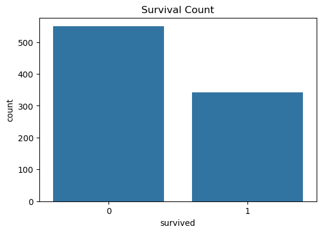
    


    
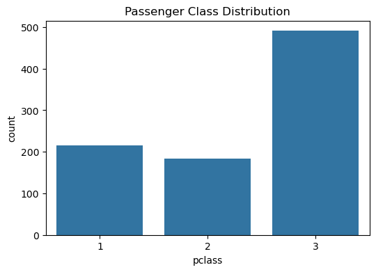
    


    
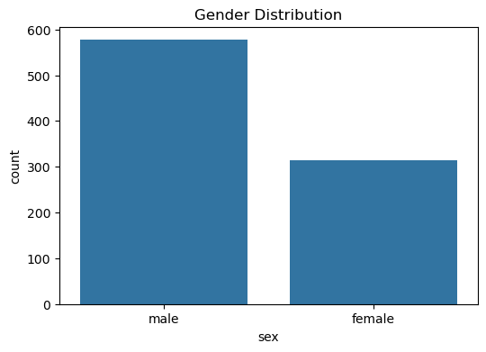
    


    
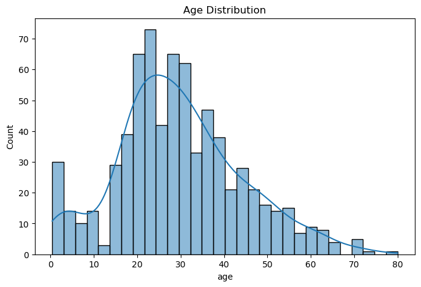
    


    
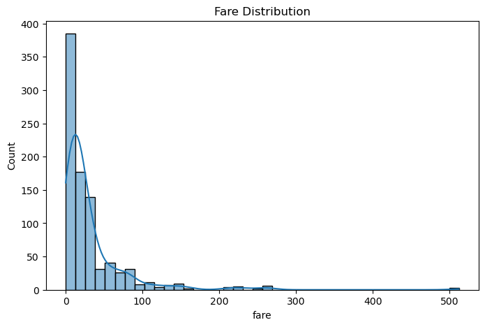
    


    
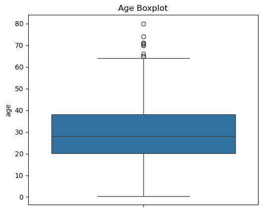
    


    
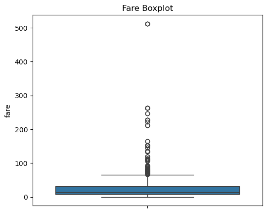
    


    
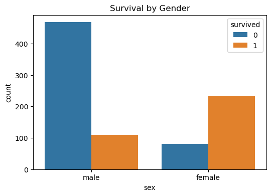
    


    
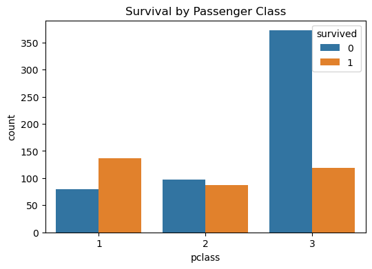
    


    
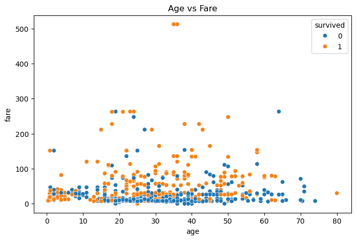
    


    
    Correlation Matrix:
    


<div>
<style scoped>
    .dataframe tbody tr th:only-of-type {
        vertical-align: middle;
    }

    .dataframe tbody tr th {
        vertical-align: top;
    }

    .dataframe thead th {
        text-align: right;
    }
</style>
<table border="1" class="dataframe">
  <thead>
    <tr style="text-align: right;">
      <th></th>
      <th>survived</th>
      <th>pclass</th>
      <th>age</th>
      <th>sibsp</th>
      <th>parch</th>
      <th>fare</th>
    </tr>
  </thead>
  <tbody>
    <tr>
      <th>survived</th>
      <td>1.000000</td>
      <td>-0.338481</td>
      <td>-0.077221</td>
      <td>-0.035322</td>
      <td>0.081629</td>
      <td>0.257307</td>
    </tr>
    <tr>
      <th>pclass</th>
      <td>-0.338481</td>
      <td>1.000000</td>
      <td>-0.369226</td>
      <td>0.083081</td>
      <td>0.018443</td>
      <td>-0.549500</td>
    </tr>
    <tr>
      <th>age</th>
      <td>-0.077221</td>
      <td>-0.369226</td>
      <td>1.000000</td>
      <td>-0.308247</td>
      <td>-0.189119</td>
      <td>0.096067</td>
    </tr>
    <tr>
      <th>sibsp</th>
      <td>-0.035322</td>
      <td>0.083081</td>
      <td>-0.308247</td>
      <td>1.000000</td>
      <td>0.414838</td>
      <td>0.159651</td>
    </tr>
    <tr>
      <th>parch</th>
      <td>0.081629</td>
      <td>0.018443</td>
      <td>-0.189119</td>
      <td>0.414838</td>
      <td>1.000000</td>
      <td>0.216225</td>
    </tr>
    <tr>
      <th>fare</th>
      <td>0.257307</td>
      <td>-0.549500</td>
      <td>0.096067</td>
      <td>0.159651</td>
      <td>0.216225</td>
      <td>1.000000</td>
    </tr>
  </tbody>
</table>
</div>


    
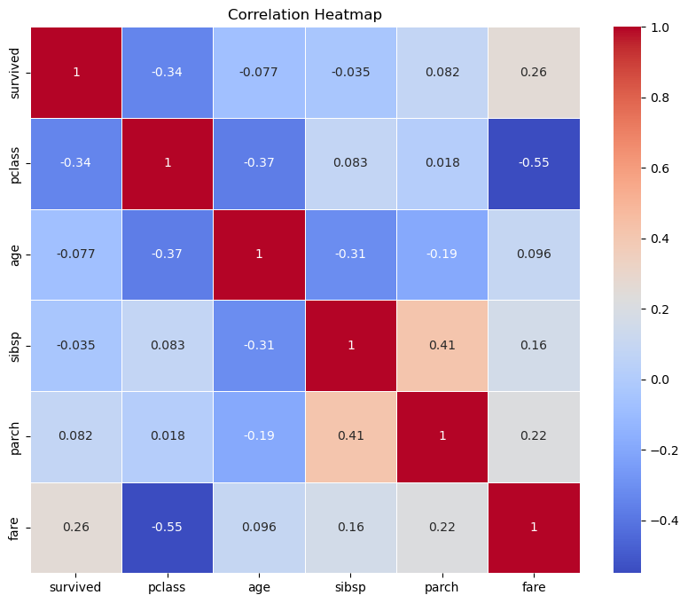
    


    
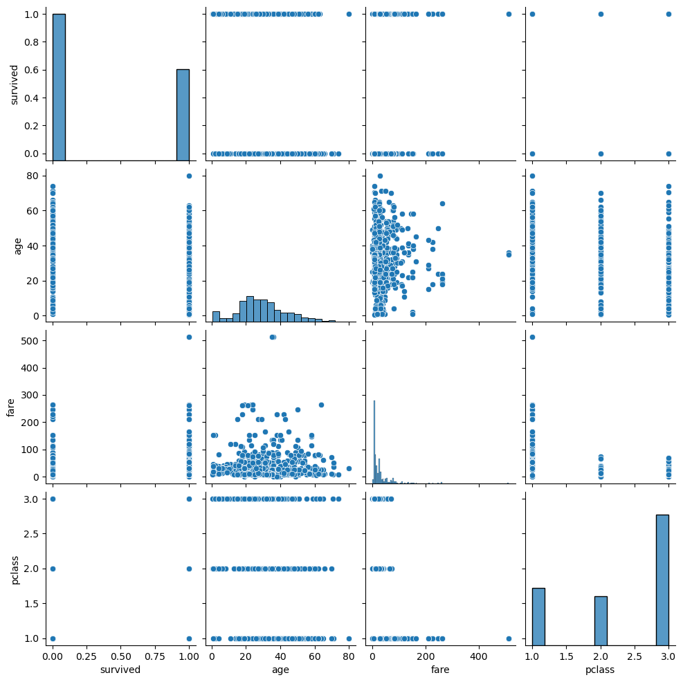
    


    
    Gender Count:
    sex
    male      577
    female    314
    Name: count, dtype: int64
    
    Passenger Class Count:
    pclass
    3    491
    1    216
    2    184
    Name: count, dtype: int64
    
    Survival Count:
    survived
    0    549
    1    342
    Name: count, dtype: int64
    
    Missing Values After Cleaning:
    survived       0
    pclass         0
    sex            0
    age            0
    sibsp          0
    parch          0
    fare           0
    embarked       0
    class          0
    who            0
    adult_male     0
    embark_town    0
    alive          0
    alone          0
    dtype: int64
    
    First Five Rows After Cleaning:
    


<div>
<style scoped>
    .dataframe tbody tr th:only-of-type {
        vertical-align: middle;
    }

    .dataframe tbody tr th {
        vertical-align: top;
    }

    .dataframe thead th {
        text-align: right;
    }
</style>
<table border="1" class="dataframe">
  <thead>
    <tr style="text-align: right;">
      <th></th>
      <th>survived</th>
      <th>pclass</th>
      <th>sex</th>
      <th>age</th>
      <th>sibsp</th>
      <th>parch</th>
      <th>fare</th>
      <th>embarked</th>
      <th>class</th>
      <th>who</th>
      <th>adult_male</th>
      <th>embark_town</th>
      <th>alive</th>
      <th>alone</th>
    </tr>
  </thead>
  <tbody>
    <tr>
      <th>0</th>
      <td>0</td>
      <td>3</td>
      <td>male</td>
      <td>22.0</td>
      <td>1</td>
      <td>0</td>
      <td>7.2500</td>
      <td>S</td>
      <td>Third</td>
      <td>man</td>
      <td>True</td>
      <td>Southampton</td>
      <td>no</td>
      <td>False</td>
    </tr>
    <tr>
      <th>1</th>
      <td>1</td>
      <td>1</td>
      <td>female</td>
      <td>38.0</td>
      <td>1</td>
      <td>0</td>
      <td>71.2833</td>
      <td>C</td>
      <td>First</td>
      <td>woman</td>
      <td>False</td>
      <td>Cherbourg</td>
      <td>yes</td>
      <td>False</td>
    </tr>
    <tr>
      <th>2</th>
      <td>1</td>
      <td>3</td>
      <td>female</td>
      <td>26.0</td>
      <td>0</td>
      <td>0</td>
      <td>7.9250</td>
      <td>S</td>
      <td>Third</td>
      <td>woman</td>
      <td>False</td>
      <td>Southampton</td>
      <td>yes</td>
      <td>True</td>
    </tr>
    <tr>
      <th>3</th>
      <td>1</td>
      <td>1</td>
      <td>female</td>
      <td>35.0</td>
      <td>1</td>
      <td>0</td>
      <td>53.1000</td>
      <td>S</td>
      <td>First</td>
      <td>woman</td>
      <td>False</td>
      <td>Southampton</td>
      <td>yes</td>
      <td>False</td>
    </tr>
    <tr>
      <th>4</th>
      <td>0</td>
      <td>3</td>
      <td>male</td>
      <td>35.0</td>
      <td>0</td>
      <td>0</td>
      <td>8.0500</td>
      <td>S</td>
      <td>Third</td>
      <td>man</td>
      <td>True</td>
      <td>Southampton</td>
      <td>no</td>
      <td>True</td>
    </tr>
  </tbody>
</table>
</div>


    
    Final Shape:
    (891, 14)
    
    ========== EDA SUMMARY ==========
    1. Dataset contains 891 rows and 15 columns.
    2. Missing values were found in Age, Embarked, Embark Town, and Deck.
    3. Missing values were handled using median and mode.
    4. Deck column was removed because it contained too many missing values.
    5. Most passengers belonged to Third Class.
    6. Male passengers were more than female passengers.
    7. Female passengers had a higher survival rate.
    8. First Class passengers had better survival chances.
    9. Fare contains several outliers.
    10. Most passengers were between 20 and 40 years old.
    11. Correlation analysis shows Fare is positively related to survival, while Passenger Class is negatively related to survival.
    
    EDA Completed Successfully.
    


```python

```
